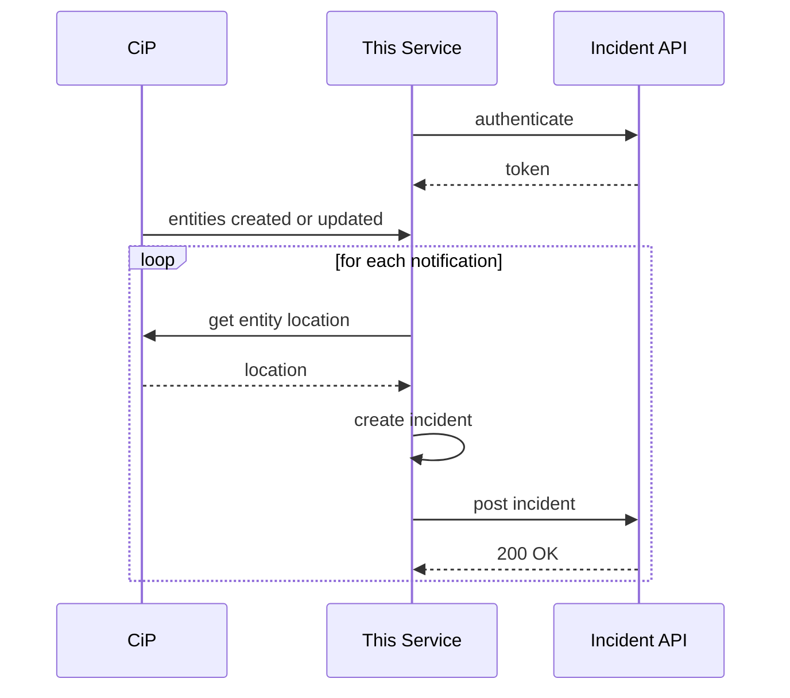

# integration-incident

An integration service for posting incident to Sundsvalls Kommuns incident API.

```mermaid
sequenceDiagram
    participant CiP
    participant This Service
    participant Incident API

    This Service->>Incident API: authenticate
    Incident API-->>This Service: token

    CiP->>This Service: entities created or updated
    loop for each notification
        This Service->>CiP: get entity location
        CiP-->>This Service: location
        This Service->>This Service: create incident
        This Service->>Incident API: post incident
        Incident API-->>This Service: 200 OK
    end
```
